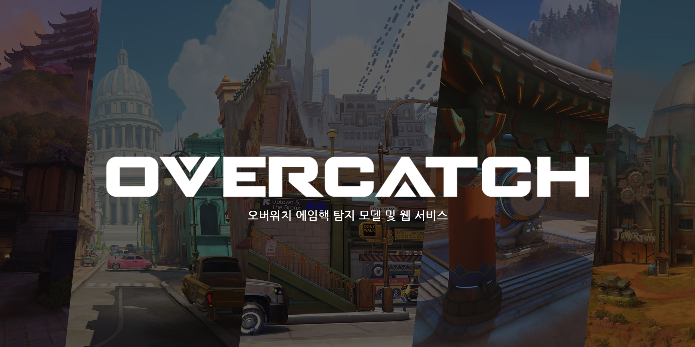
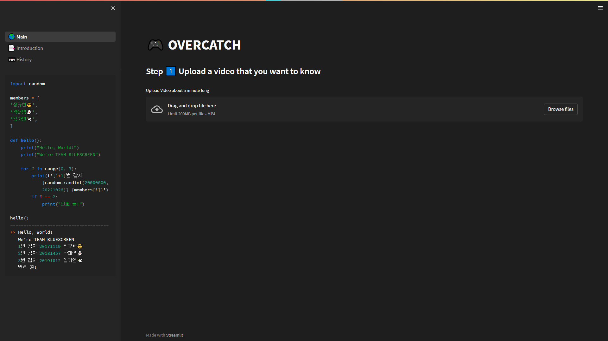
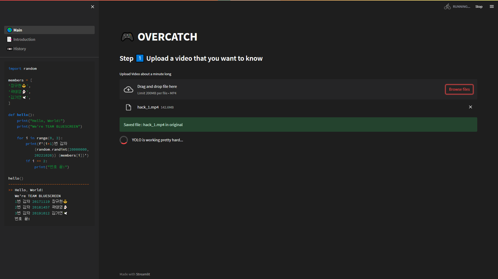
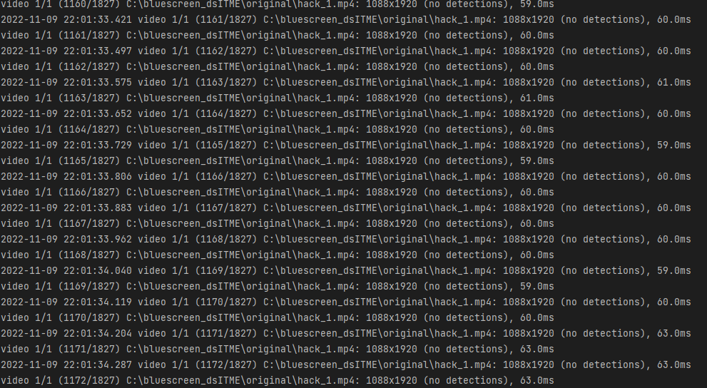
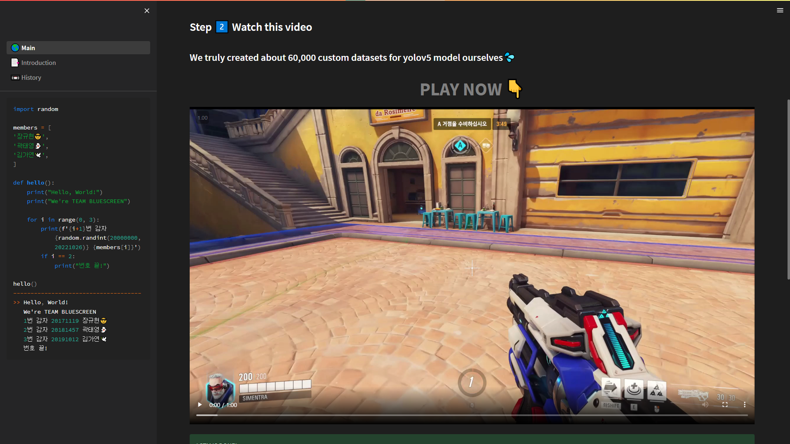
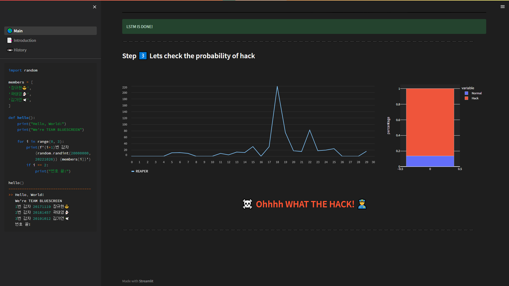

# OverCatch

2022 DSWU Graduation Project

> 💌 Please report issues If you find problems! <br>
> 💌 설명이나 작동에 문제가 있다면 이슈 작성 부탁드립니다!

> **※CAUTION※** <br>
This project refers to yolov5. <br>
yolov5 copyright is not reserved by this project. <br>



### **Overwatch Aimhack Detection**
> **Notice** <br>
❗ our team's YOLOv5 model can classify only 12 characters and kill-sign. <br>
> ❗ our project didn't consider the situation players use the same character. <br>

- **Character list**
  - ANA 
  - BASTION
  - CASSIDY
  - LUCIO
  - MEI
  - REAPER
  - ROADHOG
  - SOLDIER-76
  - SOMBRA
  - TORBJORN
  - ZARYA
  - ZENYATA

> **model file download** <br>
⚠ download and must place model file at yolov5/datasets
- [release demo v0.0.1](https://github.com/sharpie1330/OverCatch/releases/tag/demo)

---
### Run Code
> ※ Alert
> - If you rerun the code, Delete the ```original```, ```result``` folder. These are auto-generated folders.

**1. Clone repo and install requirements.txt**
```
git clone https://github.com/sharpie1330/OverCatch.git  #clone
cd yolov5
pip install -r requirements.txt  # install
```
- To use GPU, Please refer to the [link](https://pytorch.org/get-started/locally/), and run code according to your computer environment.
- Or, just use Colab and Set hardware accelerator to GPU.
- or Google it...(like, 'GPU-Accelerated Computing with Python')

**2. Change directory to root directory(Overcatch), and Run Project**
```
cd ..
streamlit run 🌎_Main.py
```

---
### How to use
> ※ Alert
> - upload files whose name is same is not allowed.

1. Click the **Browse Files** button, Choose the suspicious video, and Upload it.



2. YOLOv5 Inference will be processed. (60ms per frame, RTX 3070)


- At IDE(or etc.) terminal, you can see the code is processing.



3. You can watch the video that the inference is done. After YOLOv5 Inference, dist file is created at './result/{video_name}/dist'



4. and the LSTM model receives the distance data. It classifies isHack or Not.



---

<br>

**_이하 설명은 모두 한국어로 작성합니다._**

<br>

---

### 프로젝트 설명
> **기획 의도**

게임 핵(Hack)의 사용은 게임의 공정성을 해치고 불만을 야기합니다. 따라서 게임 핵 사용이 의심되는 유저를 게임회사에 리포트할 때 증명할 수 있는 도구로써 본 <OVERCATCH> 프로젝트를 기획했습니다.

> **작품 소개**

여러 종류의 게임 핵 중 상대 캐릭터를 자동 조준할 수 있게 하는 ‘에임 핵‘ 사용 여부를 검출하는 분류 모델과 웹 서비스를 개발했습니다. 게임 <오버워치>의 캐릭터 외관 이미지를 학습한 인공지능 모델을 만들고, 이것을 활용해 게임 플레이 영상에서 캐릭터를 검출해서 에임(조준점)과의 거리 데이터를 수집했습니다. 이 데이터를 활용해서 게임 캐릭터와 에임 사이의 거리 변화 패턴을 분석하고 게임 핵 사용 의심도를 계산하는 또 하나의 인공지능 모델을  개발했고, 본 모델을 웹에서 사용할 수 있도록 구현했습니다.

> **알고리즘 설명**

YOLOv5로 오버워치 게임 플레이 영상에서 캐릭터 객체를 검출합니다. 검출된 캐릭터의 머리 부근과 화면 중앙 조준점(에임) 사이 거리를 계산합니다.
저장된 거리 데이터는 에임핵을 사용한 영상과 사용하지 않은 영상의 차이를 특정할 수 있는 피처로 활용됩니다. 에임핵은 캐릭터 머리 쪽에 조준경을
강제적으로 위치시키므로, 조준점과 캐릭터 머리 사이 거리가 비교적 일정하게 유지되는 경향을 보이리라 예상할 수 있습니다.
<br>상대 캐릭터를 제거하면 빨간 해골 그림의 킬사인이 중앙에 나타납니다. 킬사인이 검출된 해당 프레임을 기준으로 직전 30 프레임의 거리 데이터에
각각 가중치를 부여해서 제거한 타겟으로 추정되는 캐릭터를 특정합니다.
<br>일반적으로 한 플레이 영상에서 킬 사인 여러 개가 검출되므로, 타겟 캐릭터의 킬사인 직전 30 프레임에서 추출한 피처를 LSTM 모델에 입력합니다.
LSTM 모델은 30 프레임 단위 거리 피처 각각에 대해 0과 1 사이의 값을 할당합니다. LSTM 추론 결과들의 평균을 구한 뒤, 임계값 0.5를 기준으로
이상이면 핵, 미만이면 핵이 아님으로 판단합니다.

> **참고**

- 에임 핵 구매 X → Overwatch Workshop 기능을 활용, Aim Hack 플레이 모드 직접 제작
  <br>→ 사용자 지정 모드에서 N8915 코드로 플레이 가능


- 캐릭터 중복 미허용 (한 프레임에 같은 캐릭터가 두 개 검출되었을 때 구분할 수 있는 수단 현재 없음)

- 핵 사용, 핵 미사용 영상 수집의 한계
  <br>→ 게임을 직접 플레이해 영상 수집. (따라서 편향된 결과일 수 있음. 영상 제공받아 더 학습시킬 필요 있음)
  <br>→ 캐릭터 개수 12개로 제한 (개발기간동안 Overwatch 2로 업데이트됨, Overwatch 1 당시 워크샵에서 AI 기능 제공 캐릭터 중 12개 캐릭터 선택)
  <br>→ 아나, 바스티온, 캐서디, 루시우, 메이, 리퍼, 로드호그, 솔져76, 솜브라, 토르비욘, 자리야, 젠야타

---

### 파일

- yolov5 폴더에 새로 추가된 파일 목록
  - downsize.py : 학습 중간에 중단된 파일 용량 줄이기
  - dist.py : 킬사인 프레임 추출, 킬사인 기준 이전 30프레임 분석해 킬사인에 대한 타겟 파악, 30프레임 데이터 저장(보간, 이상치 제거 등)
  - train_data_generate.py : lstm 모델 학습 데이터 생성 코드


- yolov5 내 수정된 파일
  - detect.py : dist 파일 생성 및 저장 (에임과 객체 사이의 거리)
  - utils/plots.py : 조준점과 오브젝트 헤드 추정 부분(중점에서 조금 위) 사이 거리 시각화(cv2)


- 핵 판별 결과 반환 코드
  - overcatch.py : dist.py 및 detect.py 참조하여 lstm모델 통과, 결과 반환


- Streamlit 코드
  - 🌎_Main.py
  - 📑_Introduction.py
  - 📼_History.py

---

### Language, Tool, Library, Framework

- Python
- Pycharm, VScode, Roboflow
- YOLOv5(Pytorch), LSTM(Tensorflow, Keras), Streamlit
